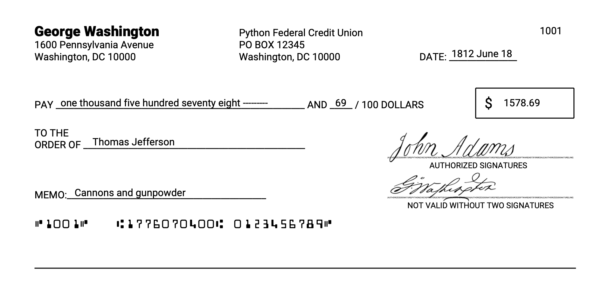

# CheckPrinter
A Python 3 script to create check PDFs which can be printed on any standard letter size check paper.

## Usage
Enter information in the `user_info.txt` and `check_info.txt` files and then run `check_printer.py`. The script will produce check PDFs ready for printing in the output folder.

## Dependencies (available via pip)
- reportlab
- inflect
- re, os, PIL

## Sample Output

